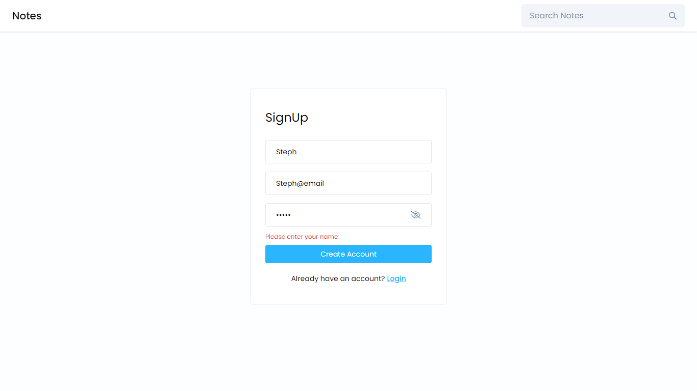
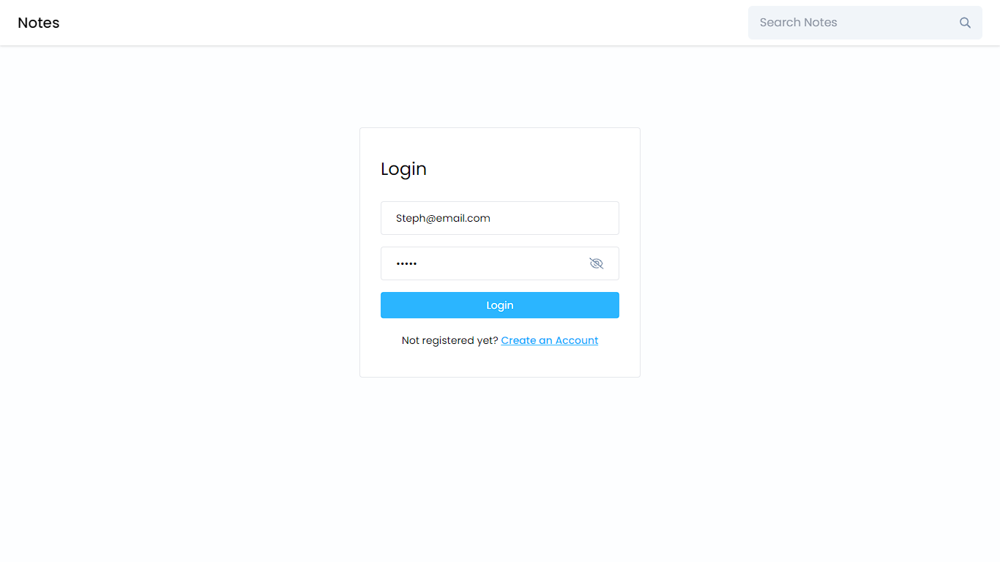
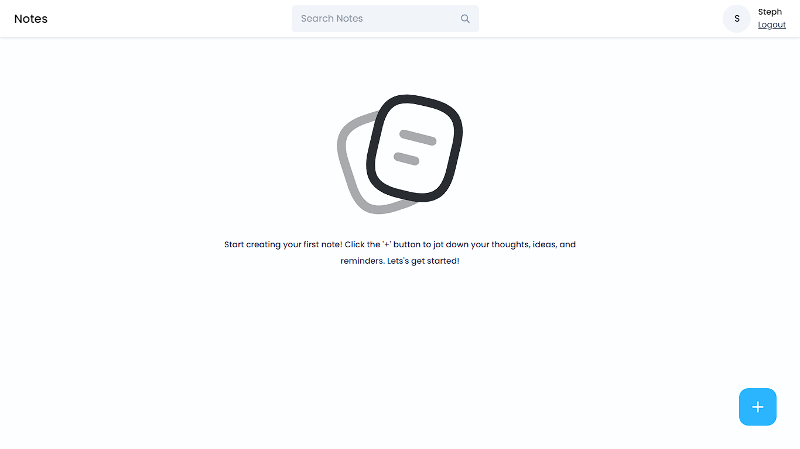
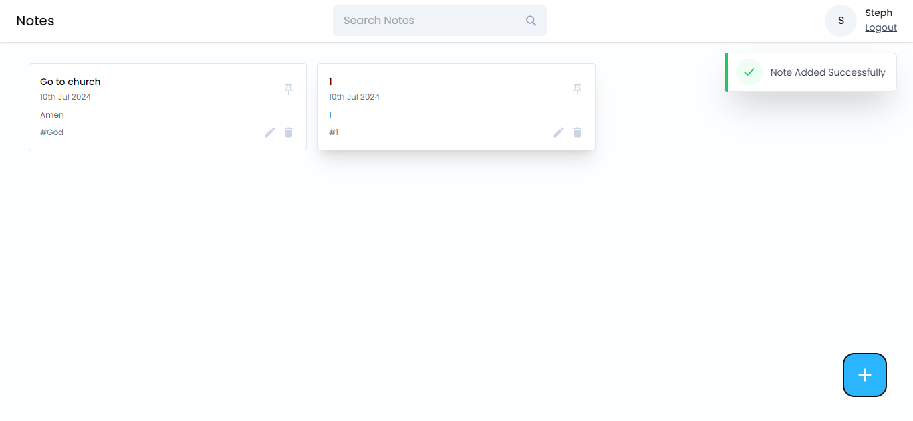
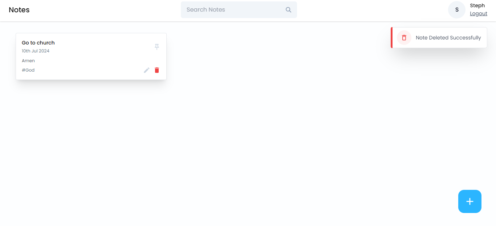
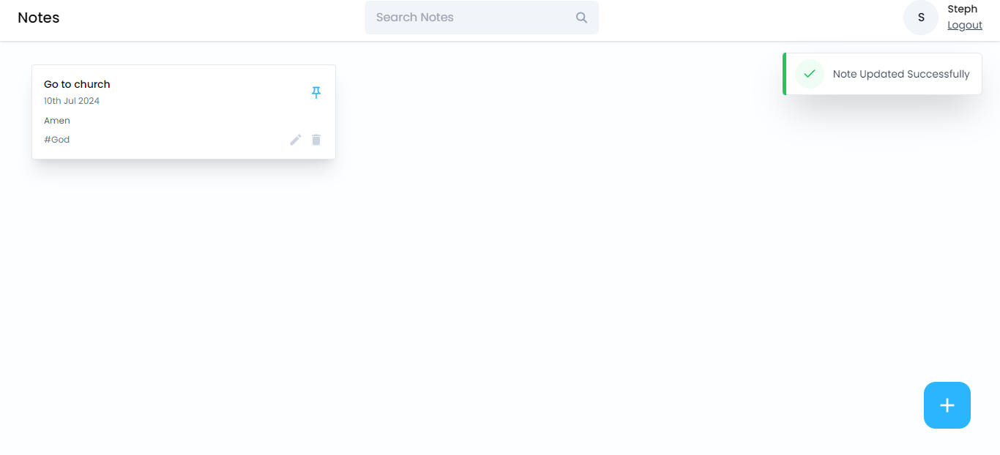

# MERN Stack Notes App

Welcome to my MERN stack Notes App project! This application demonstrates my full-stack development skills using the MERN stack (MongoDB, Express.js, React.js, Node.js). It allows users to create, read, update, and delete notes seamlessly.

## Table of Contents

- [Introduction](#introduction)
- [Features](#features)
- [Technologies Used](#technologies-used)
- [Installation](#installation)
- [Usage](#usage)
- [Screenshots](#screenshots)
- [Contact](#contact)

## Introduction

This project showcases my proficiency in building a full-stack web application with CRUD (Create, Read, Update, Delete) operations using the MERN stack. It highlights my ability to integrate front-end and back-end technologies to create a cohesive and interactive user experience.

## Features

- **User Authentication:** Secure user authentication and authorization system.
- **CRUD Operations:** Allows users to create, read, update, and delete notes.
- **Responsive Design:** Optimized for various screen sizes and devices.
- **Database Integration:** MongoDB database for storing and managing notes data.

## Technologies Used

- **MongoDB:** NoSQL database for storing application data.
- **Express.js:** Back-end framework for building robust APIs.
- **React.js:** Front-end library for building user interfaces.
- **Node.js:** Server-side JavaScript runtime environment.
- **HTML5:** Markup language for structuring the web content.
- **CSS3:** Styling the components and layout.
- **JavaScript (ES6+):** Scripting language for interactivity and logic.
- **Git:** Version control system for managing project codebase.

## Installation

1. Clone the repository:
   ```bash
   git clone https://github.com/TugaGelo/Full-Stack-Notes-App.git

2. Navigate to the project directory:
   ```bash
   cd Full-Stack-Notes-App
   
3. Install the dependencies:
   ```bash
   npm install

## Usage

1. Start the development server:
   ```bash
   cd backend

2. Start the backend server:
   ```bash
   npm start

3. Start the development server:
   ```bash
   cd frontend/notes-app
   
3. Start the frontend server:
   ```bash
   npm run dev

## Screenshots













## Contact

Email: rolandtugaoen@gmail.com

LinkedIn: [LinkedIn](https://www.linkedin.com/in/rabtugaoen/)

GitHub: [GitHub](https://github.com/TugaGelo)

Portfolio: [My Website](https://roland-tugaoen-portfolio.vercel.app)

Feel free to reach out if you have any questions or suggestions!

